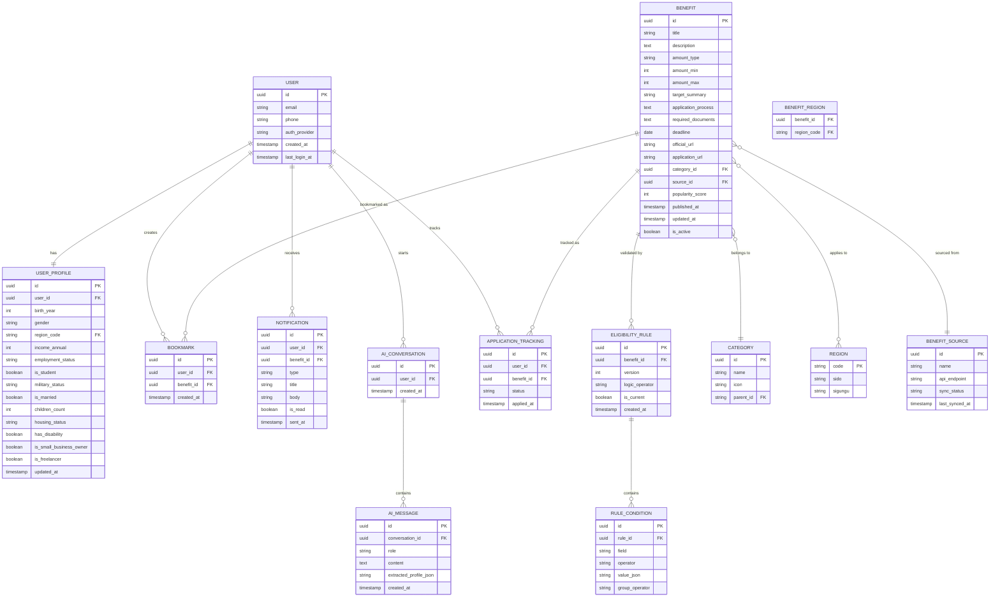

# 02. 데이터베이스 스키마 + ERD

두 종류의 저장소를 구분한다.

- **서버 DB (PostgreSQL 가정)**: 정규화된 마스터 데이터, 룰, 사용자 계정, 알림 로그
- **클라이언트 로컬 DB (Drift/SQLite)**: 서버에서 받은 혜택/룰 데이터의 오프라인 캐시 + 사용자 프로필/북마크 등 로컬 전용 데이터

## 1. ERD (서버 기준)

## 2. 테이블 상세

### `user`
| 컬럼 | 타입 | 설명 |
|---|---|---|
| id | uuid PK | |
| email | varchar, unique, nullable | 소셜로그인 시 nullable |
| phone | varchar, nullable | |
| auth_provider | enum(kakao, apple, google, guest) | |
| created_at / last_login_at | timestamp | |

### `user_profile`
| 컬럼 | 타입 | 설명 |
|---|---|---|
| birth_year | int | 나이는 계산값, 저장은 출생연도 |
| region_code | fk → region | 시/군/구 단위 |
| income_annual | int, nullable | 민감정보 — 서버 저장 시 암호화 컬럼(app-level encryption) |
| employment_status | enum(employee, self_employed, freelancer, job_seeker, student, none) | |
| military_status | enum(not_applicable, active, completed, exempted) | |
| housing_status | enum(no_house, renting, owned) | |

### `benefit`
| 컬럼 | 타입 | 설명 |
|---|---|---|
| amount_type | enum(fixed, range, percentage, unknown) | |
| amount_min / amount_max | int, KRW | |
| popularity_score | int | 북마크 수 + 조회수 기반 배치 집계 |
| source_id | fk → benefit_source | 원본 API 출처 |
| is_active | boolean | 마감/폐지된 혜택 소프트 삭제 |

### `eligibility_rule` / `rule_condition`
룰 버전 관리를 위해 `eligibility_rule`은 `version`, `is_current`를 가지며, 조건 변경 시 새 버전을 추가하고 기존 버전은 `is_current=false`로 전환한다 (감사 추적용). 상세 스키마와 평가 로직은 [05-eligibility-rule-engine.md](05-eligibility-rule-engine.md) 참조.

## 3. 클라이언트 로컬 스키마 (Drift)

서버 스키마의 읽기 전용 캐시 테이블(`CachedBenefit`, `CachedRule`, `CachedCategory`, `CachedRegion`) + 로컬 전용 테이블:

| 테이블 | 용도 |
|---|---|
| `LocalProfile` | 온보딩에서 입력한 프로필 (서버 미로그인 상태에서도 동작) |
| `LocalBookmark` | 오프라인 북마크, 온라인 전환 시 서버와 동기화 |
| `SyncMeta` | 테이블별 마지막 동기화 시각/ETag (증분 동기화용) |
| `EligibilityCache` | 프로필 해시 → 평가 결과 캐시 (재계산 비용 절감) |

## 4. 인덱싱 전략

- `benefit(is_active, deadline)` — 마감임박 쿼리
- `benefit(category_id)`, `benefit_region(region_code)` — 필터링
- `rule_condition(rule_id)` — 룰 평가 시 조건 일괄 로드
- `notification(user_id, is_read, sent_at desc)` — 알림함 조회
- `user_profile.income_annual`은 암호화 컬럼이므로 인덱스 제외, 정렬/필터는 애플리케이션 레벨 또는 별도 `income_bracket`(구간화된 비민감 컬럼)으로 대체
